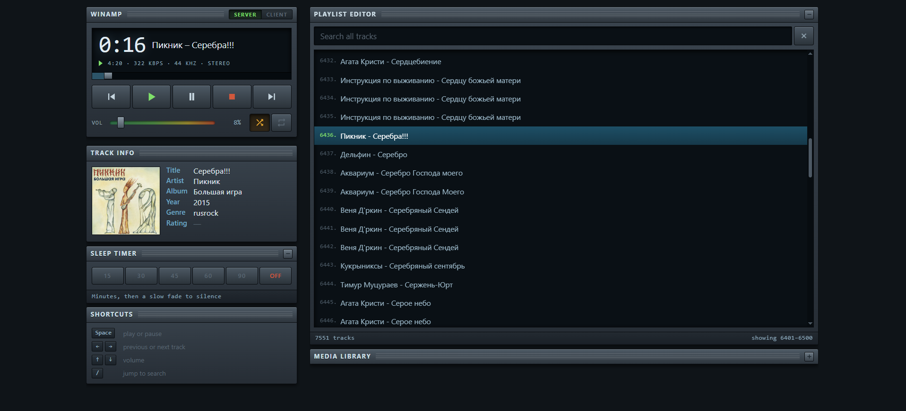
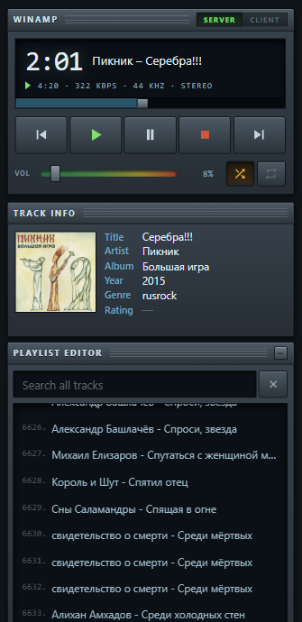

# Winamp Remote

Control Winamp running on a Windows PC from a phone, tablet or any other
browser on the same network. Or flip it around and stream the PC's library
to the device you are holding.

Built on the ancient [httpQ](https://sourceforge.net/projects/httpq/) plugin,
with a small Python proxy that fills in everything httpQ cannot do — real
tags, cover art, search, folder browsing and a sleep timer.

<table>
  <tr>
    <td align="center">
      
      <br>
      <em>Desktop</em>
    </td>
    <td align="center">
      
      <br>
      <em>Mobile</em>
    </td>
  </tr>
</table>

## What it does

- Play, pause, seek, volume, shuffle and repeat
- Track title, cover art and tags read straight from the file, so they work
  even where the plugin refuses to answer or mangles non-Latin text
- Search across the whole playlist, even with thousands of entries
- Browse the library folders and queue tracks without touching the PC
- Sleep timer with a slow fade, counted on the PC so the phone can sleep
- Lock screen controls on Android
- Client mode: the PC streams the file and your phone plays it

Nothing has to be installed beyond Python: the whole thing runs on the
standard library.

---

## 1. Install the httpQ plugin

The remote talks to Winamp through httpQ, a general purpose plugin from
2003. A copy of the installer sits in [`vendor/`](vendor) so you do not have
to go looking for it.

1. Close Winamp.
2. Run `vendor/httpq_v3.1_win_installer.exe`. When it asks where Winamp
   lives, point it at the folder holding `winamp.exe` — usually
   `C:\Program Files (x86)\Winamp`. The installer drops `gen_httpq.dll`
   into the `Plugins` subfolder.
3. Start Winamp.

The plugin is 32-bit, so it needs a 32-bit Winamp. Every normal 5.x build
qualifies; only the rare 64-bit ones do not.

### Configure it

In Winamp press `Ctrl+P`, then **Plug-ins → General Purpose**. Pick
**Winamp httpQ plugin v3.1** from the list and press **Configure selected plug-in**.

- **General → Password** — set one, you will need it in a moment;
- **General → IP Address** — leave at `0.0.0.0`;
- **General → TCP Port** — leave at `4800` unless something else already uses it;
- **General → Start service automatically** — tick the option if you don't want to click **Start** here every time WinAmp restarts;
- **Security** — set up as desired or leave blank.

Close the dialog and check the plugin answers. In a browser on the same PC:

```
http://127.0.0.1:4800/getversion?p=YOUR_PASSWORD
```

A short hex number like `0x5080` means it works. `0` means the password is
wrong. Nothing at all means the plugin did not start.

---

## 2. Set up the remote

Requires Python 3.8 or newer.

Double-click [`start.bat`](./start.bat) or run it once from this folder (if `python` opens the Microsoft Store instead of running anything, use `py` in the commands below):

```
python server.py
```

It creates `config.ini` next to itself and stops being useful until you
edit it. Open it in any text editor:

```ini
[httpq]
; The password you set in the plugin
password = 1234
host = 127.0.0.1
port = 4800

[server]
; The port the remote itself is served on
port = 8000
workers = 6

[library]
; Folders reachable from the Media library window,
; one per line, indented
roots =
    C:\Music
    D:\Downloads\Music

[tags]
encoding = cp1251
```

Set the password and your music folders at minimum. Paths go in as they
are — no doubled backslashes, no quotes. Restart the server afterwards.

---

## 3. Open the firewall

Windows blocks incoming connections by default, so the phone will not reach
either port. From a Command Prompt **run as administrator** (change `8000` to actual port you set in config):

```
netsh advfirewall firewall add rule name="httpQ" dir=in action=allow protocol=TCP localport=4800
netsh advfirewall firewall add rule name="winamp-remote" dir=in action=allow protocol=TCP localport=8000
```

Two things trip people up here.

If Windows popped up a network access dialog on the first run and you
clicked **Cancel**, a blocking rule for Python now exists, and blocking
rules win over allow rules. Open Windows Defender Firewall → Advanced
settings → Inbound Rules, sort by name, and delete any Python entries.

Also check that your network is marked **Private**, not **Public**, under
Settings → Network & Internet. Windows is far stricter on public networks.

---

## 4. Run it

Double-click [`start.bat`](./start.bat), or from a terminal in this folder:

```
python server.py
```

It prints two addresses:

```
On this computer:  http://localhost:8000
On your phone:     http://192.168.0.137:8000
Diagnostics:       http://localhost:8000/probe
```

Keep the console open — closing it stops the server.

On the phone, open the second address and use the browser menu to add the
page to the home screen. It then opens like a normal app, without the
address bar, and Android will show playback controls on the lock screen.

Worth doing once: reserve the PC's address in your router's DHCP settings.
Otherwise it can change after a reboot and the shortcut stops working.

---

## When something is wrong

Start playback, then open `http://localhost:8000/probe` on the PC. It walks
through every plugin command and shows the raw answers, then how the current
file's path was resolved, which container was detected and which tags were
parsed. That normally points straight at the broken link.

**The page will not load from the phone.** Notice *how* it fails. An
instant error means the server is not running or is bound to localhost
only. A long wait ending in a timeout means the firewall is eating the
packets — see step 3.

**Rating shows a dash.** Winamp keeps ratings in its own media library and
only writes them into files when told to. Turn that on in Winamp's media
library settings; it will not backfill files you rated earlier.

**Titles arrive as garbage.** Change `encoding` in `config.ini` from
`cp1251` to `utf-8`.

**Titles arrive as question marks.** The plugin hands text over in a single
byte encoding, so anything outside it — Japanese, for instance — is already
lost before it reaches us. The remote works around this by reading tags from
the file itself, which is where the real Unicode lives, so the display and
the track card recover even when the playlist rows cannot.

**The playlist loads slowly.** Raise `workers` in `config.ini` from 6 to 10.
Higher is not worth it: httpQ is single threaded and starts dropping
connections.

---

## Security

This is meant for a home network and asks for no password of its own.
Anyone who can reach it can drive the player and stream anything under
`roots`. Do not forward the port through your router.
